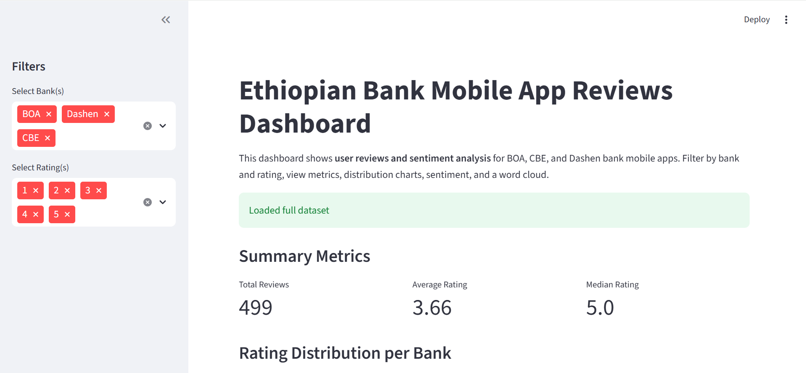

# Google Play Bank App Reviews Analysis

**Author:** Bezawit Assefa  
**Week:** 12  
**Project:** Google Play Bank App Reviews Analysis  
**Submission Date:** February 17, 2026  

  

---

## Project Overview
This project analyzes user reviews from the Google Play Store for three Ethiopian banks’ mobile applications: **BOA, CBE, and Dashen**.  

The goal is to:  
- Clean and process review data  
- Perform sentiment and theme analysis  
- Derive insights, visualize results, and recommend app improvements  

**Week 12 Improvements:**  
- Modularized code in `src/` for better organization  
- Added automated **pytest tests** for preprocessing, sentiment, and theme analysis  
- Set up **CI/CD workflow** so tests run automatically on every push  
- Built an **interactive Streamlit dashboard** for exploring reviews, ratings, and sentiment  
- Ensures **reliability and professionalism** — perfect for finance-sector portfolios  

---

## Folder Structure
```
project-root/
├── src/ # Modular Python code (preprocessing, sentiment, theme analysis)
├── tests/ # Automated pytest tests
├── notebooks/ # Jupyter notebooks for analysis and visualizations
├── data/ # Cleaned CSV datasets (full dataset)
├── dashboard/ # Streamlit dashboard code
├── screenshots/ # Dashboard and analysis screenshots
├── .github/
│ └── workflows/ # CI/CD workflow for automated testing
└── README.md # Project overview and setup instructions
```


---

## Task Summaries

### **Task 1: Data Collection & Preprocessing**
- Collected Google Play Store reviews for BOA, CBE, and Dashen apps  
- Cleaned and standardized review text  
- Stored data in CSV for further analysis  

### **Task 2: Sentiment Analysis & Theme Extraction**
- Performed sentiment scoring (positive/negative/neutral) using NLP  
- Extracted key themes (UI, Transactions, Customer Support, etc.)  
- Added columns for nouns, identified themes, sentiment labels, and scores  
- Automated tests ensure correctness and reliability  

### **Task 3: Store Cleaned Data in PostgreSQL**
- Created a database `bank_reviews` with **Banks** and **Reviews** tables  
- Inserted cleaned CSV data using Python (`psycopg2`)  

### **Task 4: Insights, Visualizations & Dashboard**
- Derived key insights per bank (strengths and pain points)  
- Built visualizations: sentiment trends, rating distributions, word cloud  
- Developed an interactive **Streamlit dashboard** for exploring metrics and filtering data dynamically  

---

##   Setup Instructions

Follow these steps to **run the project locally or view the dashboard**:

### 1️⃣ Clone the Repository
```bash
git clone https://github.com/Bezawit-cloud/google-play-app-reviews-analysis.git
cd google-play-app-reviews-analysis
```
### 2️⃣ Install Python Dependencies

Make sure you have Python 3.10+ installed. Then run:
```
pip install -r requirements.txt
```

### 3️⃣ Prepare the Dataset

- Full Dataset: Place ethopian_bank_reviews.csv in the data/ folder for full analysis.

- Sample Dataset: sample_reviews.csv is included in the repo for testing if full dataset is unavailable.

✅ The dashboard will automatically use the sample CSV if the full dataset is missing.

4️⃣ Run the Streamlit Dashboard
streamlit run dashboard/app.py


Open the displayed URL in your browser (usually `http://localhost:8501`)

Use the sidebar to filter by bank and rating

### 5️⃣ Optional: Run Tests

Check code reliability with pytest:

# pytest

- All core tests for preprocessing, sentiment, and theme analysis should pass

- CI/CD workflow on GitHub runs these tests automatically on every push

## 6️⃣ View Results & Screenshots

- Dashboard metrics: total reviews, average rating, median rating

- Charts: rating distribution, word cloud

- Screenshots are included in screenshots/ for reference





### Author

Bezawit Assefa


